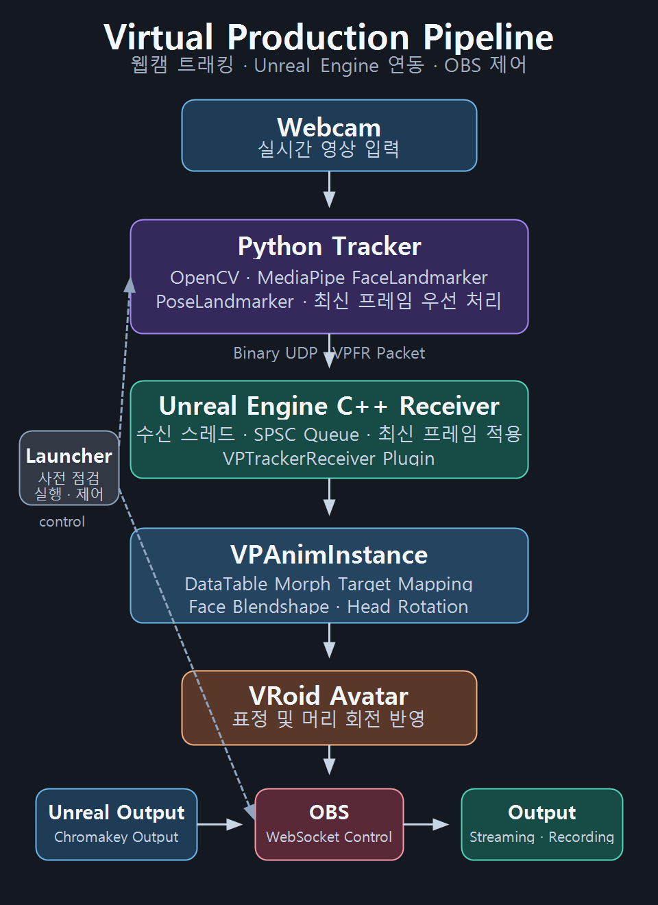

# Virtual Production Pipeline

<p align="center">
  
</p>

> **데모 구성**
> Unreal Engine 아바타 출력, Python 런처, OBS 제어 화면을 통해 웹캠 트래킹 데이터의 엔진 연동과 송출 제어 흐름을 보여 줍니다. 개인정보 보호를 위해 웹캠 원본 화면은 포함하지 않았습니다.

단일 웹캠에서 얼굴과 포즈 데이터를 추론하고, 이를 Unreal Engine 5.7에 전달해 아바타 표정과 머리 움직임에 반영하는 실시간 파이프라인 프로젝트입니다.

Python에서 MediaPipe 기반 추론과 UDP 송신을 담당하고, Unreal Engine에서는 C++ 수신 플러그인과 DataTable 기반 Morph Target 매핑을 구현했습니다. OBS WebSocket을 이용해 스트리밍과 녹화도 제어합니다.

## 데이터 흐름



웹캠에서 추론한 얼굴·포즈 데이터를 Python이 Binary UDP로 전송하고, Unreal Engine C++ 수신 플러그인이 이를 처리합니다. 아바타에는 얼굴 Blendshape와 머리 회전을 반영하며, 런처는 OBS의 스트리밍·녹화 제어를 담당합니다.

## 구현 범위

- 웹캠 기반 얼굴 Blendshape 추론 및 아바타 Morph Target 반영
- 포즈 랜드마크 수신 및 머리 회전 계산·반영
- Python → Binary UDP → Unreal Engine C++ 수신 플러그인 연동
- DataTable 기반 ARKit 호환 Blendshape와 VRoid Morph Target 매핑
- OBS WebSocket 기반 스트리밍·녹화 제어
- 런처 기반 사전 점검 및 실행 상태 확인

현재 포즈 랜드마크는 추론·전송·수신까지 구현되어 있습니다. 아바타에 실제 반영되는 범위는 얼굴 Blendshape와 머리 회전이며, 전신·상체 본 리타게팅은 포함하지 않습니다.

## 주요 구현

### 웹캠 트래킹

- OpenCV로 웹캠 영상 수신
- MediaPipe FaceLandmarker로 얼굴 Blendshape 추론
- MediaPipe PoseLandmarker로 포즈 랜드마크 추론
- 추론 스레드와 송신부 사이에서 최신 프레임 우선 큐를 사용해 오래된 프레임 제거

### Unreal Engine C++ 수신 플러그인

- `VPTrackerReceiver` 런타임 플러그인 구현
- 바이너리 UDP 패킷의 헤더·길이 검증
- 네트워크 수신 스레드와 게임 스레드를 SPSC 큐로 분리
- 게임 스레드에서는 누적 프레임 대신 최신 프레임을 적용

### 아바타 리타게팅

- ARKit 호환 Blendshape 이름과 VRoid Morph Target 이름의 차이를 DataTable로 관리
- 표정별 가중치와 데드존을 설정값으로 분리
- 매핑 테이블은 최초 1회 캐싱해 런타임에서 재사용
- 어깨·코 랜드마크를 기반으로 머리 Pitch·Yaw·Roll 계산
- 머리 회전에 스무딩과 프레임별 변화량 제한을 적용해 떨림 완화

### OBS 제어

- OBS WebSocket 연결 및 상태 확인
- 스트리밍 시작·중지
- 로컬 녹화 시작·중지
- 런처에서 트래커 프로세스와 OBS 송출 상태 확인

## 프로젝트 구성

```text
VP/
├─ VPPipeline/
│  ├─ Plugins/VPTrackerReceiver/   # Unreal Engine C++ UDP 수신 플러그인
│  ├─ Content/
│  │  ├─ Actor/BP_Receiver         # 수신 Actor 예제
│  │  ├─ Data/VRoidBlendshapeMapping
│  │  └─ Maps/Lvl_Empty
│  └─ VPPipeline.uproject
│
└─ vp-tracker/
   ├─ tracker.py                   # 웹캠·MediaPipe 추론
   ├─ sender.py                    # UDP 송신
   ├─ obs_controller.py            # OBS WebSocket 제어
   ├─ launcher.py                  # 사전 점검·실행·상태 확인
   └─ models/                      # MediaPipe 모델 파일
```

## 실행 환경

- Unreal Engine 5.7
- Python 3.12 이상
- `uv`
- 웹캠
- OBS Studio 및 WebSocket 서버
- MediaPipe 모델 파일
  - `models/face_landmarker.task`
  - `models/pose_landmarker_heavy.task`

실제 추론 FPS는 웹캠과 실행 환경에 따라 달라집니다.

## 실행 방법

### 1. Python 환경 구성

```bash
cd vp-tracker
uv sync
```

### 2. OBS WebSocket 비밀번호 설정

`vp-tracker` 폴더에 `.env` 파일을 생성합니다.

```env
VP_OBS_PASSWORD=your_obs_websocket_password
```

### 3. Unreal Engine 프로젝트 준비

1. `VPPipeline.uproject`를 열어 `VPTrackerReceiver` 플러그인을 빌드합니다.
2. 기본 맵 `/Game/Maps/Lvl_Empty`를 엽니다.
3. Unreal Editor는 실행하되, 런처 실행 전에는 PIE를 시작하지 않습니다.

### 4. 런처 실행

```bash
cd vp-tracker
uv run launcher.py
```

사전 점검과 트래커 실행이 완료되면 Unreal Editor에서 PIE를 시작합니다.

```text
stream   # OBS 스트리밍 시작
stop     # OBS 스트리밍 중지
rec      # 로컬 녹화 시작
stoprec  # 로컬 녹화 중지
status   # 트래커 프로세스와 OBS 상태 확인
quit     # 트래커 종료 및 OBS 연결 해제
```

`status`는 트래커 프로세스와 OBS 연결·송출 상태를 확인합니다. Unreal Engine의 실제 수신 상태는 Output Log에서 확인할 수 있습니다.

## 리타게팅 문제 해결

### 문제

MediaPipe의 Blendshape 이름과 VRoid 아바타의 Morph Target 이름이 달라 추론 결과를 바로 적용할 수 없었습니다.

### 해결

`FVPBlendshapeMapping` 구조체와 DataTable을 사용해 입력 Blendshape 이름, 대상 Morph Target 이름, 가중치를 분리했습니다.

`VPAnimInstance`는 DataTable을 최초 1회 캐싱한 뒤 매 프레임 캐시된 매핑을 사용합니다. 이를 통해 캐릭터별 명명 규칙과 표정 강도를 코드 수정 없이 조정할 수 있습니다.

## 검증 방법

### 웹캠·MediaPipe 트래킹 확인

```bash
cd vp-tracker
uv run test_phase1.py
```

웹캠 입력, Blendshape 개수, 포즈 랜드마크 개수, 추론 FPS를 콘솔에서 확인합니다.

### Unreal Engine 수신·표정 반영 확인

Unreal Editor에서 PIE를 실행한 뒤 다음 명령을 실행합니다.

```bash
cd vp-tracker
uv run test_phase3.py
```

테스트 패킷을 전송하고 Unreal Output Log의 수신 로그와 아바타의 표정 변화를 확인합니다.
